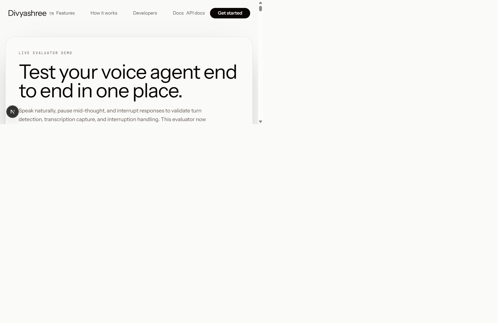
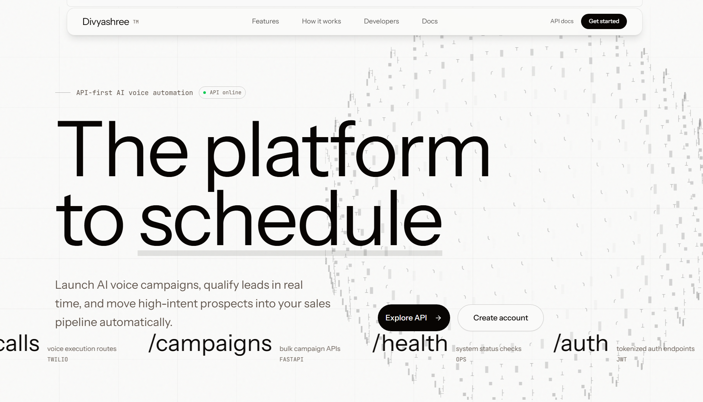

# Divyashree Voice Platform

AI-powered voice outreach platform for outbound campaigns, lead qualification, follow-up workflows, and real-time call analytics.

This repository includes:
- Next.js frontend (landing + live voice evaluator)
- FastAPI backend (auth, agents, campaigns, contacts, analytics, knowledge base)
- Voice gateway (Twilio/WebSocket real-time pipeline)
- Shared AI services (LLM, STT, TTS, cache, qualification logic)
- SQL schema/migrations and deployment tooling

## What's New (April 2026)

- Improved browser voice stability by fixing WebSocket connect/close race handling.
- Upgraded mic/VAD pipeline for better speech pickup and reduced noisy false positives.
- Reworked evaluator UX into a full first-class section with transcript-only scrolling.
- Reduced evaluator lag via render throttling, memoized rows, and lighter meter updates.
- Strengthened bilingual web STT behavior (English + Hindi), with safer language switching.
- Added web STT turn diagnostics for faster production troubleshooting.
- Added WOW submission deliverables:
	- System prompt PDF
	- Requirement compliance one-pager

## Demo Media

### Live Evaluator (Landing)

### WOW Deliverables

- [System Prompt PDF](docs/deliverables/System_Prompt_Priya_WOW.pdf)
- [Requirement Compliance One Pager](docs/deliverables/WOW_Requirement_Compliance_One_Pager.md)

## Core Capabilities

- AI agent prompt configuration and runtime system-prompt resolution
- Bulk campaign creation from CSV/Excel contact uploads
- Outbound call initiation and call-state tracking
- Real-time transcript capture and post-call analysis fields
- Deterministic WOW checkpoint guidance and qualification normalization
- Knowledge-base retrieval (RAG) for detail-rich responses
- Barge-in-aware voice pipeline with interruption intent handling
- Bilingual handling (English + Hindi) in web voice evaluator flow

## Architecture

- Frontend (Next.js): landing page, evaluator UI, marketing sections
- Backend (FastAPI): API domain services and orchestration
- Voice Gateway (FastAPI/WebSocket): real-time audio processing + AI loop
- Data layer: PostgreSQL-compatible schema and migrations
- Infra: Docker Compose, Redis, ngrok/Cloudflare tunnel scripts

## Tech Stack

- Frontend: Next.js 16, React 19, TypeScript, Tailwind CSS
- Backend: FastAPI, Python, async database access
- Voice/AI: Twilio, Groq LLM/STT paths, TTS integration
- Ops: Docker Compose, Redis, ngrok, Cloudflare tunnel scripts

## API Surfaces

- System: `/health`, `/info`, `/api-credits`
- Auth: `/auth/signup`, `/auth/login`, `/auth/refresh`, `/auth/verify-token`
- Agents: `/agents`
- Calls: `/calls/outbound`, `/calls`, `/calls/{id}`
- Campaigns: `/campaigns`, `/campaigns/create`, `/campaigns/{id}/start`

Postman collection:
- [docs/Divyashree_API.postman_collection.json](docs/Divyashree_API.postman_collection.json)

## Service Ports

- Frontend: `http://localhost:3000`
- Backend API: `http://localhost:8000`
- Voice Gateway: `http://localhost:8001`
- Redis: `localhost:6379`
- ngrok Inspector: `http://localhost:4040`

## Repository Layout

- `frontend/` - Next.js UI and evaluator
- `backend/` - FastAPI API routes and services
- `voice_gateway/` - real-time voice session gateway
- `shared/` - common AI/database/cache clients and prompt assets
- `db/` - schema and migrations
- `docs/` - architecture docs and submission deliverables
- `scripts/` - utility and automation scripts

## Notes

- Branding and runtime naming are Divyashree.
- Legacy migration/support docs are intentionally kept for operational continuity.
